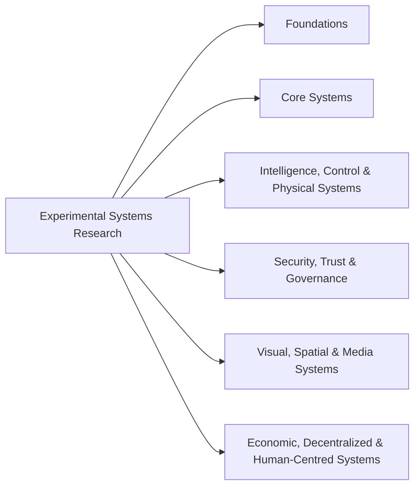

<div align="center">

# Hi, I'm Dong 👋

### Experimental systems research across computation, communication, state, failure, recovery, and trust

*Build carefully. Disturb assumptions. Measure behaviour. Understand the system.*

</div>

---

## About

I am a software engineer with a strong interest in **systems research**, especially where behaviour changes under:

```text
performance pressure
failure
uncertainty
partial knowledge
recovery
trust constraints
```

My research is organised around a **set of focused experimental questions and technical domains**.

The work is intentionally divided into focused areas rather than treated as one monolithic subject.

Each area has a distinct research boundary so that questions can be explored with clearer mechanisms, cleaner evidence, and more precise claims.

---

## Research Focus

Broadly, my research interest sits around:

```text
Computation
    +
Communication
    +
Persistent State
    +
Concurrency
    +
Independent Nodes
    +
Coordination
    +
Time
    +
Failure / Recovery
    +
Trust
```

I am especially interested in questions such as:

- What changes when assumptions stop holding?
- What happens when communication becomes delayed, unstable, or unavailable?
- How do systems behave when different nodes see different state?
- What survives failure, and when is recovery actually complete?
- What does an identity, proof, or attestation really establish?
- How do local mechanisms produce system-level behaviour?

---

## Research Areas

My current research interests span six broad areas:

- Foundations
- Core Systems
- Intelligence, Control & Physical Systems
- Security, Trust & Governance
- Visual, Spatial & Media Systems
- Economic, Decentralized & Human-Centred Systems

---

## Research Structure



---

## How I Approach Research

A recurring principle in my work is:

> **Measure before explaining.**

I generally follow a process like this:

```text
Question
   ↓
Hypothesis
   ↓
Model / System
   ↓
Experiment
   ↓
Measurement
   ↓
Observation
   ↓
Interpretation
   ↓
Limitations
   ↓
Next Question
```

Several distinctions matter to me:

```text
Measurement
!=
Observation
!=
Interpretation
```

And likewise:

```text
Identity
!=
Authority

Process Restarted
!=
System Recovered

Attested
!=
Semantically Correct

More Metrics
!=
More Independent Evidence
```

---

## Language and Tools

I choose languages and tools based on the question being studied.

Commonly used languages and formalisms across these repositories include:

```text
Go
Rust
C
C++
Python
R
Julia
TypeScript
SQL
Shell
Assembly

Wasm / WASI
eBPF / BPF

TLA+
Alloy
SMT / SAT

MATLAB / Simulink
SystemVerilog / Verilog / VHDL
```

The principle is simple:

> **Language before tool. Mechanism before complexity. Evidence before claim.**

---

## About This GitHub

This GitHub is mainly a home for:

- research-oriented systems experiments;
- systems investigations;
- mathematical and computational experiments;
- measurement and reproducibility work;
- long-term technical learning through implementation.

Some investigations are narrow and experimental by design.

Some are broader research themes.

Together, they form a structured record of how I study systems behaviour across multiple layers.

---

<div align="center">

### Build carefully. Disturb assumptions. Measure behaviour. Understand the system.

</div>
